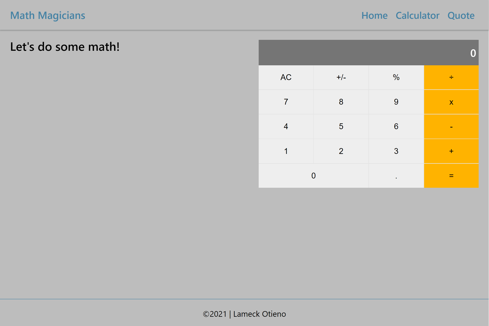

# Math Magicians

## Table of Contents

* [About the Project](#about-the-project)
* [Built With](#built-with)
* [Getting Started](#getting-started)
* [Contributing](#contributing)
* [Author](#author)
* [Acknowledgements](#acknowledgements)

## About Project

"Math magicians" is a website for all fans of mathematics. It is a Single Page App (SPA) that allows users to:

* Make simple calculations.
* Read a random math-related quote.



## [Live Demo - GH pages](https://lameck1.github.io/math-magicians/)
## [Live Demo - Netlify](https://mathmagiciansapp.netlify.app/)
## [Live Demo - Heroku](https://mathmagician.herokuapp.com/)

## Built With

* ReactJS

## Getting Started

* Clone this repo <https://github.com/Lameck1/math-magicians>

    ```bash
    git clone https://github.com/Lameck1/math-magicians.git
    ```

* Navigate to math-magicians folder/directory

    ```bash
    cd math-magicians
    ```

* On the comandline, at the project's root, run ```yarn install``` to install app dependencies

* Next, run ```yarn start``` which will run the app in the development mode.

* Open [http://localhost:3000](http://localhost:3000) to view it in the browser.

* ALTERNATIVELY

  * Just run ```yarn run build``` which will build the project and generate output files into the ```build``` directory.

  * Go to ```build``` directory and manually open ```index.html``` to interact with the app

## Contributing

Contributions, issues, and feature requests are welcome!

Feel free to check the [issues page](https://github.com/Lameck1/math-magicians/issues)

  1. Fork the Project
  2. Create your Feature Branch (`git checkout -b feature/newFeature`)
  3. Commit your Changes (`git commit -m 'Add some newFeature'`)
  4. Push to the Branch (`git push -u origin feature/newFeature`)
  5. Open a Pull Request

## Author

👤 **Lameck Otieno**

* GitHub: [@githubhandle](https://github.com/Lameck1)
* Twitter: [@twitterhandle](https://twitter.com/lameck721)
* LinkedIn: [LinkedIn](https://www.linkedin.com/in/lameck-odhiambo-642b7077/)
* Portfolio: [Portfolio](https://lameck.me)

## Acknowledgements

* [ReactJS Organization](https://www.themealdb.com/api.php) for the amazing [Documentation](https://reactjs.org/docs/getting-started.html) on React.

## Show your support

Give a ⭐️ if you like this project!
